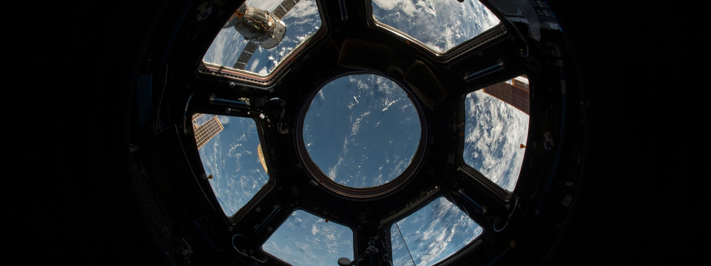

  

<table>
<tr>
<td width="70%" valign="top">

### Hey there, I'm Rajkumary 👋

Full-stack software developer · activist · curious builder, based in Bangladesh.

I build and ship web applications from idea to production, working across **frontend, backend, databases, authentication, APIs, and deployment**. My current stack:

I'm interested in building technology that solves real problems, particularly at the intersection of **civic tech, communities, accessibility, and the web**.

**Things I've built:**

- 🏛️ **[Docket](https://docket.bd)** ([LinkedIn](https://linkedin.com/company/trydocket)) — a production civic-tech platform built with Next.js, Supabase, and structured government-service data to simplify navigating government services in Bangladesh
- 🗂️ **[Project Apa](https://projectapa.com)** ([LinkedIn](https://linkedin.com/company/project-apa)) — a documentation platform for grassroots organisations, built to manage activities, records, and reporting in one place
- 💡 **[ShitBucket](https://shitbucket.fyi)** — an open-source productivity and idea-management tool that I'm continuously building and experimenting with

Beyond my own products, I've worked as a freelance developer on multiple web platforms, taking projects from requirements and architecture through development, deployment, and iteration.

I'm especially interested in **full-stack development, product engineering, civic tech, open source, and cybersecurity**.

</td>
<td width="30%" align="center">

</td>
</tr>
</table>

  

